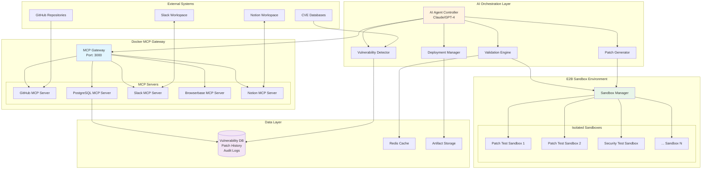
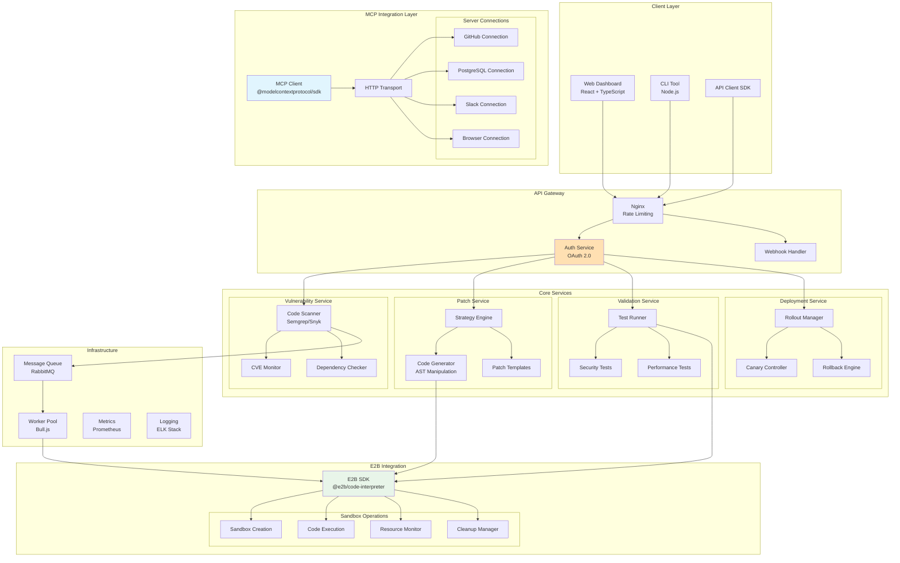
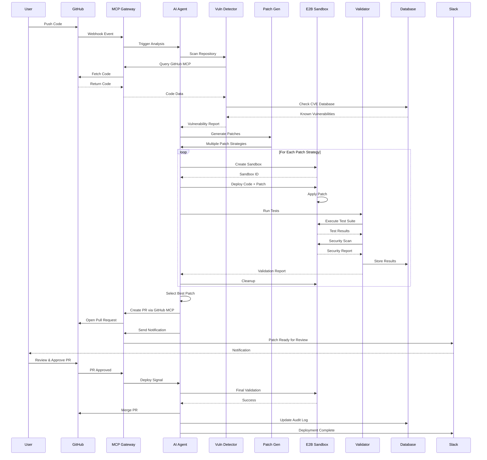
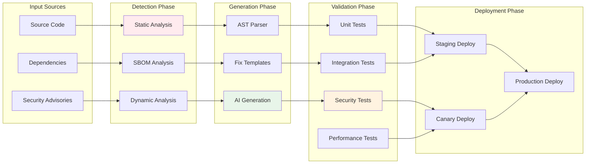
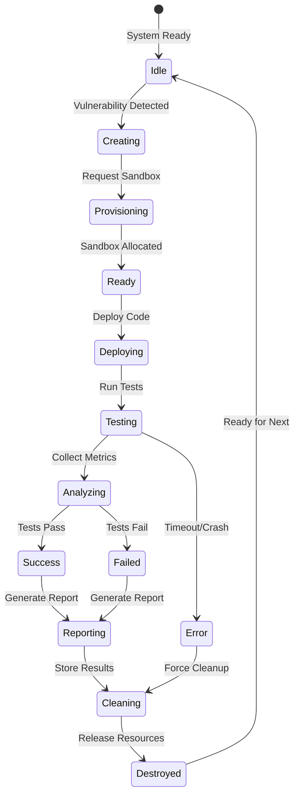
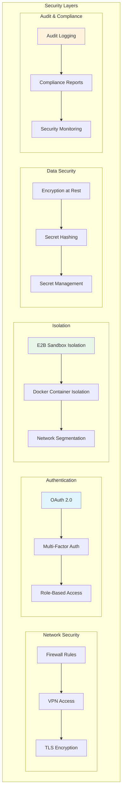
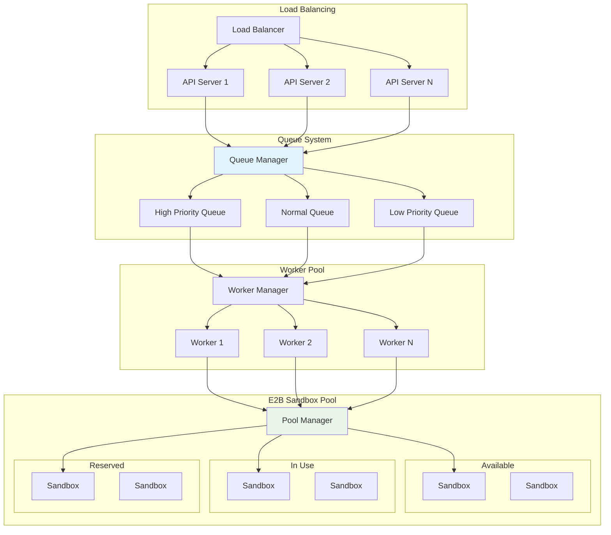

# AI DevSecOps Pipeline Orchestrator
## Architecture

## System Overview

```
┌─────────────────────────────────────────────────────────────────┐
│                 AI DevSecOps Pipeline Orchestrator              │
│                         (Python Application)                     │
└─────────────────────────────────────────────────────────────────┘
                                │
                ┌───────────────┼───────────────┐
                │               │               │
                ▼               ▼               ▼
        ┌──────────────┐ ┌──────────┐ ┌──────────────┐
        │  MCP Client  │ │  OpenAI  │ │ E2B Sandboxes│
        │   (stdio)    │ │   API    │ │     API      │
        └──────────────┘ └──────────┘ └──────────────┘
                │
                ▼
        ┌──────────────┐
        │ Docker MCP   │
        │   Gateway    │
        └──────────────┘
                │
        ┌───────┼────────┐
        │       │        │
        ▼       ▼        ▼
    ┌────┐  ┌────┐  ┌────────┐
    │ GH │  │ SL │  │  PW    │
    │MCP │  │MCP │  │  MCP   │
    └────┘  └────┘  └────────┘
```

## Component Architecture

### Layer 1: Orchestration Layer
**Location**: `src/core/orchestrator.py`

Coordinates the entire pipeline:
- Workflow management
- Component integration
- Error handling
- Result aggregation

### Layer 2: Integration Layer

#### MCP Client (`src/mcp/`)
- **client.py**: Base MCP client
- **github.py**: GitHub operations
- **slack.py**: Slack notifications

#### AI Services (`src/patch/`)
- **generator.py**: OpenAI integration
- Patch generation
- Test script creation

#### Sandbox Services (`src/sandbox/`)
- **manager.py**: E2B management
- Test execution
- Result capture

### Layer 3: Business Logic

#### Vulnerability Detection (`src/vulnerability/`)
- **scanner.py**: Dependency scanning
- CVE detection
- Risk prioritization

### Layer 4: Infrastructure

#### Configuration (`src/core/`)
- **config.py**: Environment management
- Settings validation

#### Utilities (`src/utils/`)
- **logger.py**: Logging setup
- Rich formatting

## Data Flow

### 1. Vulnerability Detection Flow
```
Repository → GitHub MCP → requirements.txt → Scanner → Vulnerabilities
```

### 2. Patch Generation Flow
```
Vulnerabilities → OpenAI API → Patches → Validation
```

### 3. Testing Flow
```
Patches → E2B Sandbox → Install → Test → Results
```

### 4. Notification Flow
```
Results → Slack MCP → Team Notification
```

## Technology Stack

### Core Technologies
- **Python 3.10+**: Main language
- **MCP SDK**: Model Context Protocol
- **E2B**: Secure sandboxes
- **OpenAI**: AI patch generation

### MCP Servers (Docker)
- **github-official**: Repository operations
- **slack**: Team notifications
- **playwright**: Browser automation

### Supporting Libraries
- **pydantic**: Data validation
- **click**: CLI framework
- **rich**: Terminal UI
- **aiohttp**: Async HTTP

## Security Architecture

### Isolation Layers
1. **E2B Sandboxes**: Complete isolation for code execution
2. **Docker Containers**: MCP servers in containers
3. **API Keys**: Secure credential management
4. **OAuth**: GitHub authentication

### Data Protection
- API keys in environment variables
- No hardcoded credentials
- Secure communication channels
- Audit logging

## Scalability Considerations

### Parallel Processing
- Multiple E2B sandboxes simultaneously
- Async operations throughout
- Non-blocking I/O

### Resource Management
- Sandbox lifecycle management
- Connection pooling
- Automatic cleanup

## Error Handling

### Levels
1. **Component Level**: Try/catch in each module
2. **Integration Level**: Graceful degradation
3. **Pipeline Level**: Rollback and recovery
4. **User Level**: Clear error messages

### Logging
- Rich formatted output
- Severity levels
- Contextual information
- Debug mode support Documentation

### High-Level Architecture Diagram



### Low-Level Architecture Diagram



### Data Flow Diagram



### Component Interaction Diagram



### E2B Sandbox Lifecycle



### Security Architecture



### Scalability Design



## Technical Stack

### Core Technologies
- **Runtime**: Node.js 20.x with TypeScript
- **AI Models**: Claude 3.5 Sonnet / GPT-4
- **Framework**: Express.js / Fastify
- **Database**: PostgreSQL 15 + Redis
- **Message Queue**: RabbitMQ / Bull.js

### MCP Integration
- **MCP SDK**: @modelcontextprotocol/sdk
- **Transport**: HTTP/STDIO
- **Docker CLI**: docker mcp command suite

### E2B Integration
- **SDK**: @e2b/code-interpreter
- **Sandboxes**: Ubuntu 22.04 isolated environments
- **Resource Limits**: 1 CPU, 2GB RAM per sandbox

### Security Tools
- **SAST**: Semgrep, SonarQube
- **Dependency Scanning**: Snyk, OWASP Dependency Check
- **Container Scanning**: Trivy, Clair

### Monitoring & Observability
- **Metrics**: Prometheus + Grafana
- **Logging**: ELK Stack (Elasticsearch, Logstash, Kibana)
- **Tracing**: OpenTelemetry + Jaeger
- **Alerting**: PagerDuty / Opsgenie

## Deployment Architecture

### Container Structure
```yaml
services:
  api-gateway:
    image: nginx:alpine
    ports: ["80:80", "443:443"]
  
  orchestrator:
    image: devsecops-orchestrator:latest
    environment:
      - E2B_API_KEY=${E2B_API_KEY}
  
  mcp-gateway:
    image: docker:mcp-gateway
    ports: ["3000:3000"]
  
  postgres:
    image: postgres:15
    volumes: ["./data:/var/lib/postgresql/data"]
  
  redis:
    image: redis:7-alpine
    command: redis-server --appendonly yes
```

### Kubernetes Deployment
```yaml
apiVersion: apps/v1
kind: Deployment
metadata:
  name: devsecops-orchestrator
spec:
  replicas: 3
  selector:
    matchLabels:
      app: orchestrator
  template:
    metadata:
      labels:
        app: orchestrator
    spec:
      containers:
      - name: orchestrator
        image: devsecops-orchestrator:latest
        resources:
          requests:
            memory: "512Mi"
            cpu: "500m"
          limits:
            memory: "1Gi"
            cpu: "1000m"
```

## Performance Considerations

### Optimization Strategies
1. **Sandbox Pooling**: Pre-warm sandboxes for instant availability
2. **Parallel Processing**: Test multiple patches simultaneously
3. **Caching**: Cache vulnerability data and test results
4. **Async Operations**: Non-blocking I/O for all external calls
5. **Resource Limits**: Enforce strict limits on sandbox resources

### Benchmarks
- **Sandbox Creation**: < 2 seconds
- **Patch Generation**: < 10 seconds
- **Test Execution**: < 5 minutes (average)
- **Full Pipeline**: < 15 minutes end-to-end

## Disaster Recovery

### Backup Strategy
- **Database**: Daily snapshots with 30-day retention
- **Artifacts**: S3 versioning with lifecycle policies
- **Configuration**: Git-based config management

### Failover Plan
- **Multi-region**: Deploy across 3+ regions
- **Auto-failover**: Health checks trigger automatic failover
- **Data Replication**: Real-time replication to standby regions